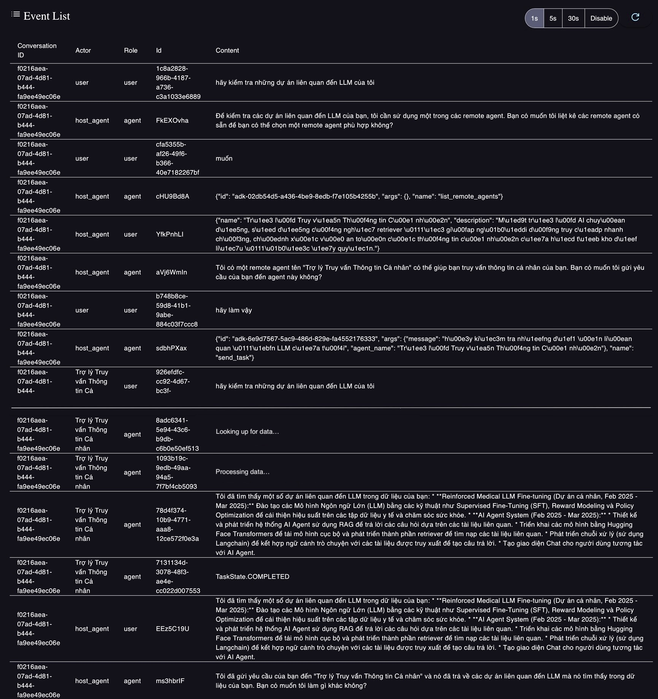

# AI Agents với Giao thức A2A

Các AI Agents được xây dựng bằng [LangGraph](https://langchain-ai.github.io/langgraph/) thông qua giao thức A2A. Nó trình bày các tương tác đàm thoại với hỗ trợ cho đối thoại nhiều lượt và phản hồi dạng streaming. Ta sẽ áp dụng giao thức này để tạo ra nhiều Agent con, mỗi Agent con có nhiều skill và chức năng riêng biệt để hỗ trợ cho Agent chính, Agent chính sẽ có chức năng điều hướng các tác vụ cho các Agent con để thực hiện các chức năng và phản hồi lại kết quả.

## Cơ cấu hoạt động

Tác nhân này sử dụng LangGraph với Google Gemini để cung cấp thông tin trao đổi thông qua ReAct agent pattern. Giao thức A2A cho phép tương tác chuẩn hóa với Agent, cho phép user gửi yêu cầu và nhận cập nhật theo thời gian thực.

Ví dụ cơ bản về cách giao thức A2A chạy với PersonalInfoAgent:

```mermaid
sequenceDiagram
    participant Client as A2A Client
    participant Server as A2A Server
    participant Agent as LangGraph Agent
    participant Retriever as LangChain Retriever

    Client->>Server: Gửi task truy vấn dữ liệu
    Server->>Agent:  Chuyển tiếp task tới Personal Agent

    alt Complete Information
        Agent->>Retriever: Gọi personal_data_retriever_tool
        Retriever->>Agent: Trả về thông tin truy vấn được
        Agent->>Server: Xử lý dữ liệu rồi trả về kết quả
        Server->>Client: Phản hồi dựa trên thông tin đã truy vấn
    else Incomplete Information
        Agent->>Server: Yêu cầu bổ sung thông tin
        Server->>Client: Đặt trạng thái "input-required"
        Client->>Server: Gửi thông tin bổ sung
        Server->>Agent: Chuyển tiếp thông tin
        Agent->>Retriever: Gọi personal_data_retriever_tool
        Retriever->>Agent: Trả về thông tin truy vấn được
        Agent->>Server: Xử lý dữ liệu rồi trả về kết quả
        Server->>Client: Phản hồi dựa trên thông tin đã truy vấn
    end
```

## Key Features

- **Multi-turn Conversations**: Agent có thể yêu cầu thông tin bổ sung khi cần thiết
- **Real-time Streaming**: Cung cấp trạng thái cập nhật liên tục trong quá trình xử lý
- **Push Notifications**: Hỗ trợ thông báo dựa trên
- **Conversational Memory**: Duy trì ngữ cảnh trong các tương tác giữa các Agents
- **Data Retriever Tool**: Sử dụng Retriever để truy xuất các thông tin liên quan có tồn tại trong documents để phản hồi cho user

## Prerequisites

- Python 3.13 hoặc cao hơn
- [UV](https://docs.astral.sh/uv/)
- API Key cho LLM

## Setup & Running

1. Thư mục hiện hành sẽ là thư mục gốc.

2. Tạo file môi trường chứa API_KEY:

   ```bash
   echo "GOOGLE_API_KEY=your_api_key_here" > .env
   ```

3. Chạy Agent:

   ```bash
   python agents/<agent_to_run>/__main__.py
   ```

  Url và port tuỳ vào configs/*-agent.yaml. Ví dụ: http://localhost:10000

  Có nhiều Agent thì sẽ chạy nhiều file với các host và port khác nhau.

4. Chạy [UI](/demo/README.md) để tương tác với các Agents :

   ```bash
   python demo/ui/main.py
   ```

Có thể dụng `uv run .` thay cho `python <file>.py` trong quá trình sử dụng.

## Triển khai

- **LangGraph ReAct Agent**: Sử dụng ReAct pattern cho việc suy luận và sử dụng tools
- **Streaming Support**: Cung cấp incremental updates trong quá trình xử lý
- **Checkpoint Memory**: Duy trì trạng thái hội thoại giữa các lượt
- **Push Notification System**: Cập nhật dựa trên webhook với xác thực JWK
- **A2A Protocol Integration**: Tuân thủ các thông số kỹ thuật của A2A

## Hạn chế

- Chỉ hỗ trợ đầu vào/đầu ra văn bản (không hỗ trợ multi-modal)
- Memory dùng trong session, không được lưu lại nên dữ liệu sẽ mất giữa các lần khởi động

## Demo conversation



## Learn More

- [A2A Protocol Documentation](https://google.github.io/A2A/#/documentation)
- [LangGraph Documentation](https://langchain-ai.github.io/langgraph/)
- [Google Gemini API](https://ai.google.dev/gemini-api)